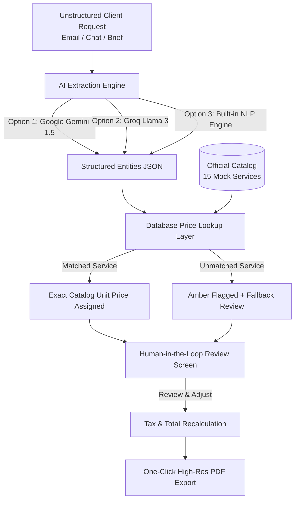

# ⚡ Kodnexus SmartInvoice – AI-Powered Invoice Automation

[](https://nextjs.org/)
[](https://tailwindcss.com/)
[](https://www.typescriptlang.org/)
[](#-anti-hallucination-pricing-architecture)

> **Kodnexus AI Build Battle – Smart Invoice Challenge**  
> An intelligent invoice automation web application that transforms unstructured natural language customer requests into structured, priced, and review-ready professional invoices within milliseconds.

---

## 📌 Executive Summary

Freelancers, agencies, and tech vendors lose dozens of hours manually deciphering client emails, briefs, and chat messages into billable invoices. Traditional LLM-based tools frequently **hallucinate pricing** or format line items incorrectly.

**Kodnexus SmartInvoice** solves this with a **Dual-Engine Architecture**:
1. **AI / NLP Extraction Layer**: Extracts client names, contact details, requested services, quantities, and terms from raw unstructured text.
2. **Anti-Hallucination Pricing Catalog**: Strictly cross-references extracted services against an authoritative benchmark pricing catalog (`mock_data`), preventing AI price hallucinations.
3. **Human-in-the-Loop Review Dashboard**: Allows operators to review, edit quantities, tweak rates, configure GST/tax brackets, and resolve unmatched custom services before producing a pixel-perfect PDF.

---

## 🚀 Key Features

### 1. ✍️ Natural Language Input & 1-Click Evaluation Presets
- Accepts unstructured client emails, messy Slack/WhatsApp chats, or bulleted briefs.
- Includes **4 preloaded evaluation presets** for instant judge and evaluator testing:
  - **Preset 1:** FinTech Startup Web & Cloud Launch (Dev + Cloud services)
  - **Preset 2:** Brand Identity & Design Package (Design & UX services)
  - **Preset 3:** Security Audit + Custom AI Model (**Smart Fallback Test**)
  - **Preset 4:** SEO & Growth Marketing Campaign

### 2. 🛡️ Anti-Hallucination Database Price Lookup
- All 15 benchmark services from `mock_data` are loaded into an authoritative catalog:
  - *Full-stack Web App Module* (₹45,000)
  - *REST API Development* (₹18,000)
  - *Mobile App Module* (₹35,000)
  - *Database Design & Setup* (₹15,000)
  - *UI/UX Wireframing* (₹8,000)
  - *UI/UX Design Package* (₹25,000)
  - *Brand Identity Design* (₹18,000)
  - *Cloud Setup & Deployment* (₹22,000)
  - *Cloud Migration* (₹40,000)
  - *IT Consulting* (₹12,000)
  - *Software Architecture Review* (₹20,000)
  - *Digital Marketing Campaign* (₹30,000)
  - *SEO Optimization Package* (₹16,000)
  - *Website Maintenance* (₹10,000)
  - *Security Assessment* (₹28,000)
- **Price Integrity Guarantee:** The LLM is never permitted to set catalog item prices; rates are bound to the verified catalog via exact, alias, and fuzzy token matching.

### 3. ⚠️ Smart Fallback Handling
- Services requested by clients that do not exist in the official catalog (e.g., custom bespoke AI models) are automatically flagged with an **Amber Alert** (`⚠ Unmatched Service`).
- Operators can enter a custom rate or map the item to an existing catalog service via an inline dropdown.

### 4. 🎛️ Human-in-the-Loop Review Dashboard
- **Inline Editing:** Edit client details, invoice numbers, issue and due dates.
- **Quantity Steppers:** Easily bump quantities up/down with live subtotal recomputation.
- **Flexible Tax Engine:** Support for GST (0%, 5%, 12%, 18% standard, 28%) and custom discounts.
- **Multi-Currency:** Instant toggle between INR (`₹`), USD (`$`), EUR (`€`), and GBP (`£`).

### 5. 📄 Pixel-Perfect PDF Export & Print
- One-click high-resolution PDF download powered by `html2canvas` and `jsPDF`.
- Native browser print stylesheet for paper and digital filing.
- Celebratory confetti trigger upon successful export.

### 6. ⚡ Multi-Model & Offline Resilience
- Supports **Google Gemini 1.5 Flash** and **Groq (Llama 3 70B)** via the AI Settings modal.
- Includes a **Built-in Smart NLP Engine** that operates **completely offline with zero API keys required**, ensuring tests and live demos never fail.

---

## 🏗️ Architecture & Data Flow



---

## 📦 Installation & Setup

### Prerequisites
- Node.js `v18.17+` or `v20+` or `v22+`
- npm `v9+` or `v10+`

### 1. Clone Repository & Install Dependencies
```bash
git clone https://github.com/your-username/kodnexus-smart-invoice.git
cd kodnexus-smart-invoice
npm install
```

### 2. (Optional) Configure Environment Variables
Create a `.env.local` file if you wish to use your own Gemini or Groq API keys by default:
```env
# Optional: App works 100% offline out-of-the-box without keys!
GEMINI_API_KEY="your-gemini-api-key"
GROQ_API_KEY="your-groq-api-key"
```

### 3. Run Development Server
```bash
npm run dev
```
Open [http://localhost:3000](http://localhost:3000) in your browser.

### 4. Build for Production
```bash
npm run build
npm run start
```

---

## 🧪 Testing the Presets

1. Open the web interface at `http://localhost:3000`.
2. Select any sample preset from the **Client Request Input** panel (e.g. *Brand Identity & Design Package* or *Security Audit + Custom AI Model*).
3. Click **"Generate Structured Invoice"**.
4. Observe the extracted client info, matched services (`✓ SRV007 Matched`, etc.), and real-time total computation.
5. In the right panel, edit line items, modify the GST dropdown, or click **"Download PDF"**.

---

## 🛠️ Technology Stack

| Layer | Technology | Purpose |
| :--- | :--- | :--- |
| **Framework** | Next.js 16 (App Router) | High-performance React framework with server-side API routes |
| **Styling** | Tailwind CSS v4.0 | Sleek SaaS aesthetics, dark mode, responsive layout |
| **Icons** | Lucide React | Modern visual indicators and action controls |
| **AI Extraction** | Gemini 1.5 Flash / Groq / NLP | Parsing natural language entities to structured JSON |
| **Data Catalog** | Local CSV / TypeScript Module | Authoritative 15-service benchmark pricing (`mock_data`) |
| **PDF Generation** | html2canvas + jsPDF | Client-side crisp vector/raster A4 PDF export |
| **Animations** | canvas-confetti + Tailwind transitions | Micro-interactions and polish |

---

## 👥 Hackathon Submission Info
- **Project Name:** Kodnexus AI Build Battle – Smart Invoice Challenge
- **Sprint Duration:** 180 Minutes
- **Platform:** Unstop
